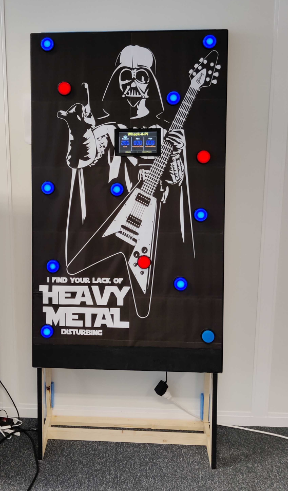
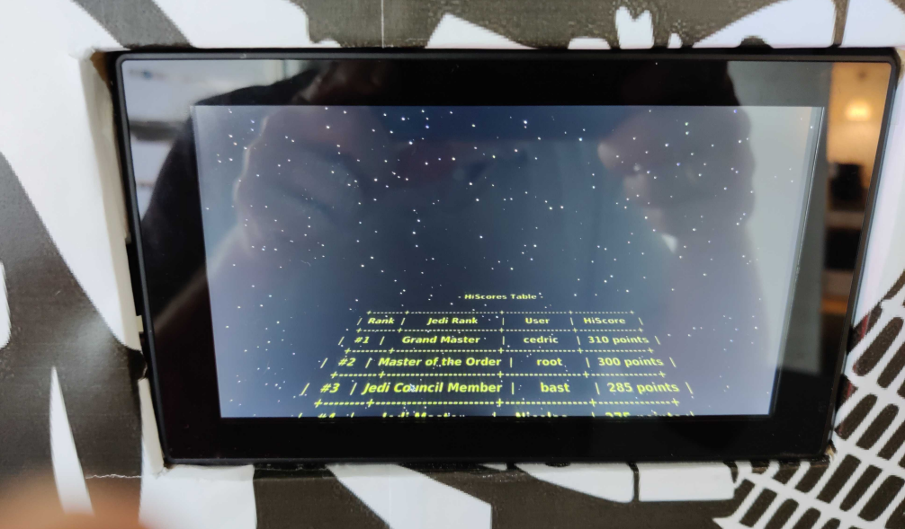

# Whack-A-Pi

This is an enhanced version of the game described in this excellent blog post https://fortoffee.org.uk/2016/03/whack-a-pi/

Main features that were added:
- Store all players scores, not only highest scores
- Store additional metadata per game (latest game timestamp, mean hit time, number of games)
- Add a 'HiScore' & 'Recent Players' screen
- Add a 'Settings' screen
- Add score penalty in case wrong button is pressed 
- Star Wars theme

## Hardware
- Raspberry pi 4B
- Waveshare 7inch IPS Capacitive Touch Screen
- 13x 6cm arcade buttons + led & microswitches
- Some Portable USB Speaker
- bunch of cables (20AWG & 22AWG to wire the buttons/LEDs to the RPi)

## Construction
- Wooden structure [plans](doc/wooden_structure.md)
- Picture preparation  [picture](doc/picture_prep.md)
- Drilling button & screen holes [drilling](doc/drilling.md)
- Cabling [cabling](doc/cabling.md)

## Install
Make sure you have pyenv installed, then run:

    make setup-venv

## Run
Simply run:

    python main.py

And if you don't have a raspberry Pi plugged in, you can mock the GPIO device with:

    GPIOZERO_PIN_FACTORY=mock python main.py

The start-up position of the window can be provided with for instance:
    
    SDL_VIDEO_WINDOW_POS=10,10

For testing/troubleshooting purposes, it is possible to launch a thread that will trigger the buttons in a loop,
this allows for testing without a Pi. Use `BUTTON_THREAD=1` env var to turn this on. The following is what I typically
use for development:

    GPIOZERO_PIN_FACTORY=mock BUTTON_THREAD=1 python main.py

In case a button breaks or is not available, it is also possible to remove one from the game
by its index (starting at 0) with for instance:

    DISABLED_BTN=4

And the following is what I use when it runs on the Pi with the external monitor plugged in:

    SDL_VIDEO_WINDOW_POS=0,0 python main.py

## Screensaver
The repo includes a way to have the hiscores printed on the star wars screensaver from xscreensaver utility.
To configure on the RPI, install xscreensaver

    apt-get install xscreensaver xscreensaver-data-extra xscreensaver-gl-extra

Create a bash file (e.g *print_pretty_hiscores.sh*) with a content similar to:

    SCORE_FILE="dev/Whack-A-Pi/scores.json" ~/.pyenv/versions/whack-a-mole/bin/python dev/Whack-A-Pi/pretty_hiscore.py

Then open xscreensaver and go to  star wars > advanced tab, and in 'Program', set:

    bash dev/Whack-A-Pi/print_pretty_hiscores.sh
    

## Credits
The LED Clock (or 7 segment style) font is called Digital 7 and is freeware available from styleseven.com