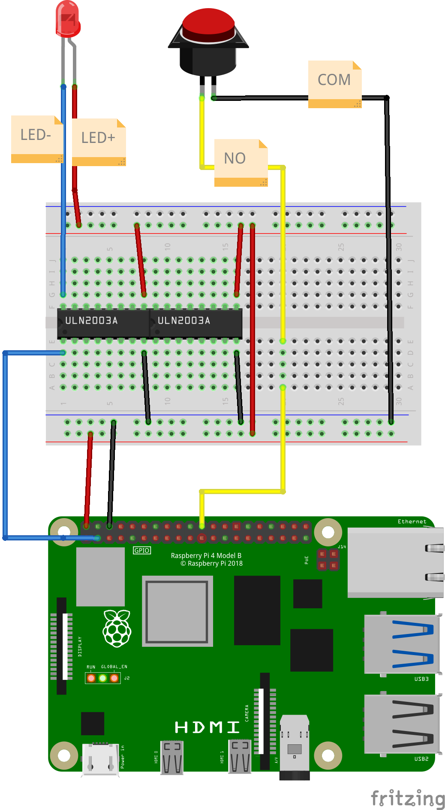
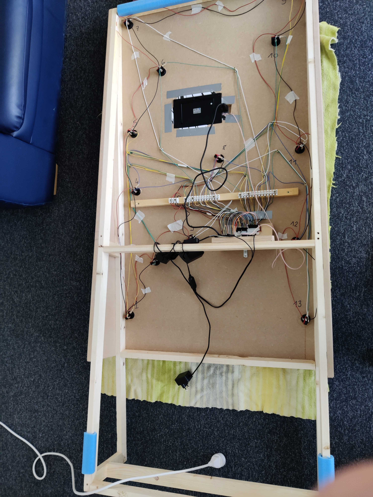

# Cabling

## Steps

Here is the electronic schema (built with Fritzing) showing how 1 button is wired. Basically:
- Buttons are directly wired to the RaspberryPu GPIO pin
- The Buttons' LEDs have their (-) pin going through a ULN2003A transistor

In practice, it is stlightly different as:
- all the (+) pin of the LEDs are chained
- all the (-) pin of the Buttons are chained

